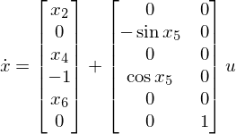

# DroneSim

ドローン(PVTOLシステム)のシミュレーター

## 概要

Xbox One ワイヤレス コントローラー から入力を読み取り、
PVTOLシステムのリアルタイムシミュレーションをする。

状態方程式は、状態をx={x1,...,x6}、入力をu={u1,u2}として、

である。

## ビルドに必要なもの

- Visual Studio 2017
- DXライブラリ 3.18e http://dxlib.o.oo7.jp/
- Boost C++ Libraries 1.65.0 http://www.boost.org/

## ビルドの仕方

DXライブラリをダウンロードして解凍する。

このリポジトリのプロジェクトを開いてDXライブラリのパスを通す。
(http://dxlib.o.oo7.jp/use/dxuse_vscom2017.html の 「4.ＤＸライブラリを使用するためのプロジェクトの設定を行う」の5～8をやる)

Boost C++ Libraries をダウンロードして解凍する。ビルドしなくていい。

DXライブラリと同じようにパスを通す。「追加のインクルードディレクトリ」にboost_1_65_0のディレクトリを追加する。

コントローラーをつなげる。USBでもBluetoothでもいい。つなげ方はググる。

Ctrl + F5 でビルド。画面が出たら成功。
